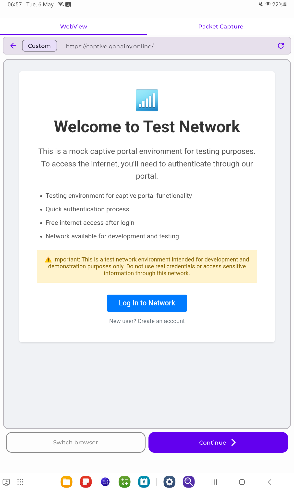
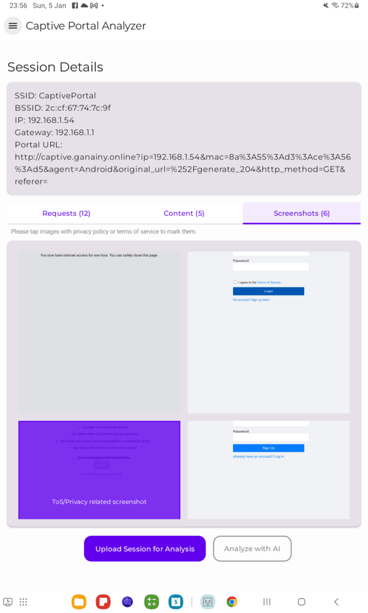
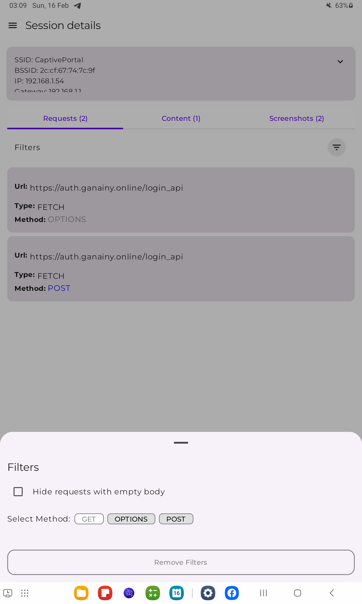
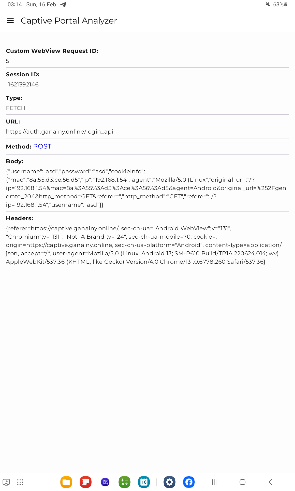
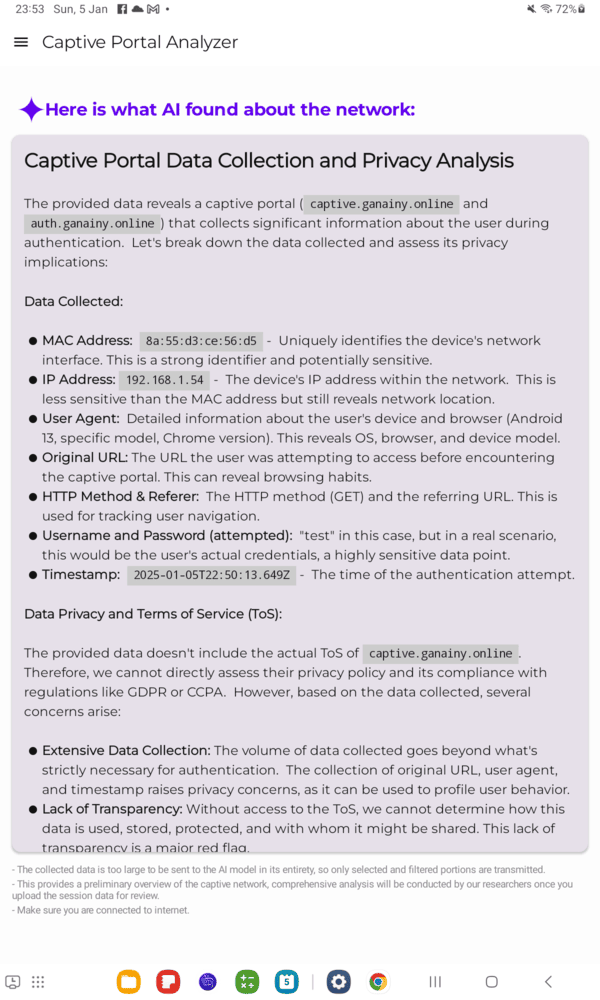
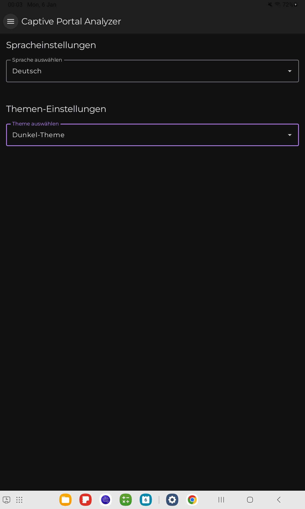
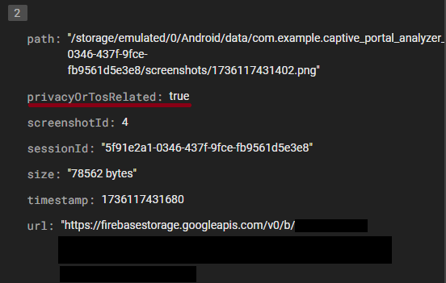
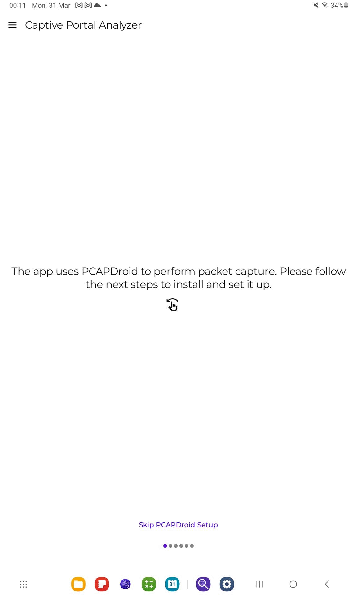
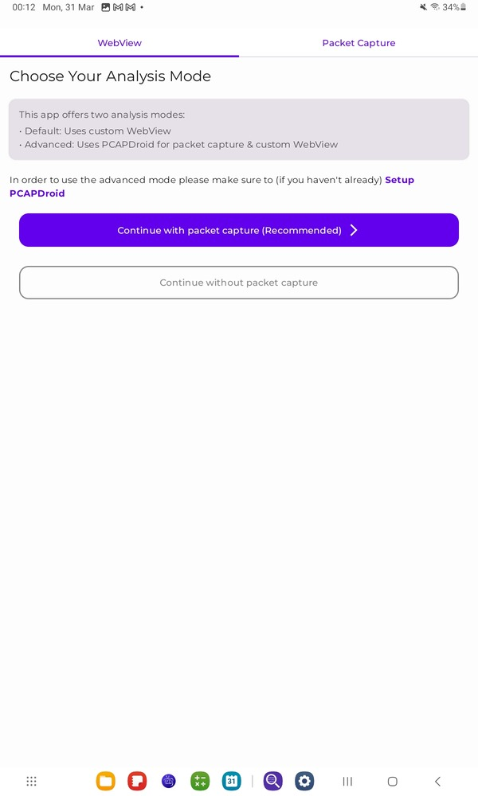
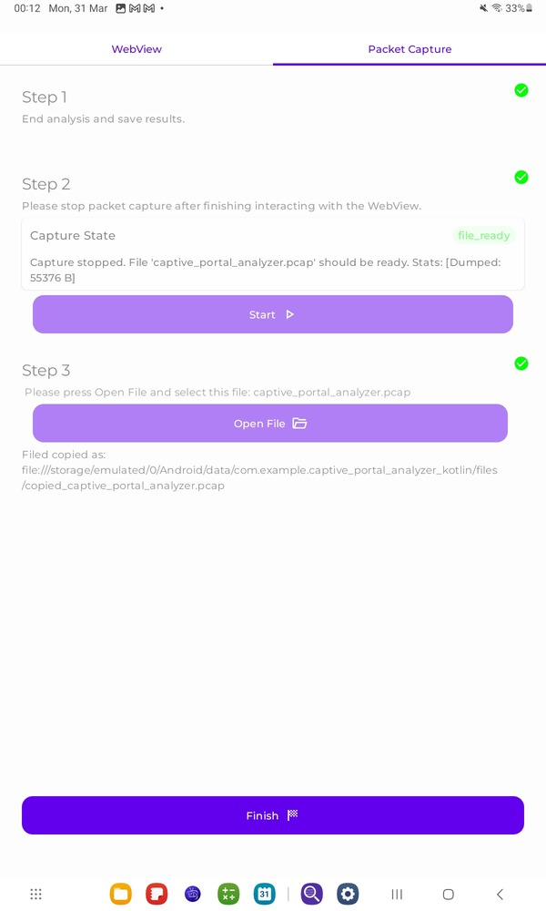

# Captive Portal Analyzer

## Overview

This app focuses on analyzing captive portals. It provides an interface for interacting with captive portals directly through the app by gathering POST request bodies, headers, creating sessions, capturing screenshots, and analyzing their data collection and privacy using AI-powered analysis. Additionally, the app allows uploading analyzed data for further examination by our team.
> **Note:** The app is designed to work with physical devices only since it interacts with real captive portals. 

---
## Project Structure
For detailed information about the project files structure and architecture, see [Project Structure](APP_STRUCTURE.md).

## Features

- Interact with captive portals seamlessly.
- Automatically gather and manage POST request bodies and headers.
- Filter and view collected requests details.
- Automatically create and manage sessions effortlessly.
- Automatically capture screenshots of portal interactions.
- Perform AI-powered privacy and data collection analysis.
- Upload analyzed data for extended review by our team.
> All login/sign up data is stored locally and not sent to the backend unless users choose to upload,
> nonetheless it is preferable to use fake data when signing up/logging in.
---

## Tech Stack

- **Language:** Kotlin
- **Framework:** Jetpack Compose
- **Architecture:** MVVM (Model-View-ViewModel)
- **Libraries:**
    - Room for local database
    - Coil for image loading
    - Gemini AI SDK for AI integration
    - Compose Markdown for rendering markdown content
    - Android Request Inspector WebView for network analysis
- **Backend:**
    - Firebase Firestore for data storage
    - Firebase Storage for image storage

---

## Preview

### Video Demonstrations:

#### Collecting information about a captive portal network:

<br>
[Download video for better quality](preview/videos/create-session.mp4)

#### Analyze collected data with AI:

<br>
[Download video for better quality](preview/videos/mark-analyze-with-ai_blurred.mp4)

### Screenshots:
| Feature                                                                              | Screenshot                          |
|--------------------------------------------------------------------------------------|-------------------------------------|
| **Interacting with captive portal from the app**                                     |  |
| **Detailed View of collected data**                                                  |  |
| **Filter collected requests**                                                        |  |
| **Show each collected request in details**                                           |  |
| **AI Insights about the captive portal**                                             |  |
| **Control language & theme**                                                         |  |
| **Fetched request bodies saved to backend**                                          |  |
| **Screenshots related to Privacy policy/ToS<br/> uploaded to back end for analysis** |  |
---

### 🆕: Integration with [PCAPDroid](https://github.com/emanuele-f/PCAPdroid) (See branch `android-pcap-api`)
| Feature                                                                                                                  | Screenshot                                     |
|--------------------------------------------------------------------------------------------------------------------------|------------------------------------------------|
| ** Instructions screen to help user do the one time setup of PCAPDroid **                                                |  |
| ** User can choose to use the JS injection WebView only or JS injection WebView + PCAPDroid packet capture **            |           |
| ** The resulting .pcap file from PCAPDroid is uploaded to the remote server with the previously collected network data** |           |
---
> **Note:** The starting and ending of packet capture is directly handled within the app.

## How to Run the App

1. Clone the repository:
   ```bash
   git clone https://github.com/ganainy/captive-portal-analyzer-kotlin.git
   ```

2. Set up API Keys and Configuration:

   a. **Gemini AI API Key:**
    - Get your API key from [Google AI Studio](https://makersuite.google.com/app/apikey)
    - Add your Gemini AI API key to `local.properties` file in the project root 
      ```properties
      apiKey=your_api_key_here
      ```

   b. **Firebase Setup:**
    - Go to [Firebase Console](https://console.firebase.google.com/)
    - Create a new project or select an existing one
    - Download the `google-services.json` file
    - Place `google-services.json` in the `app` directory

3. Build and run the project on a physical device.


---

## Contributions

Contributions are welcome! Feel free to submit a pull request or report issues to enhance the app.

---
