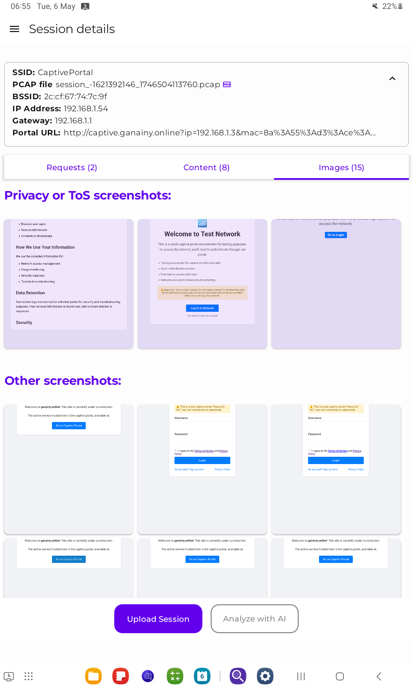
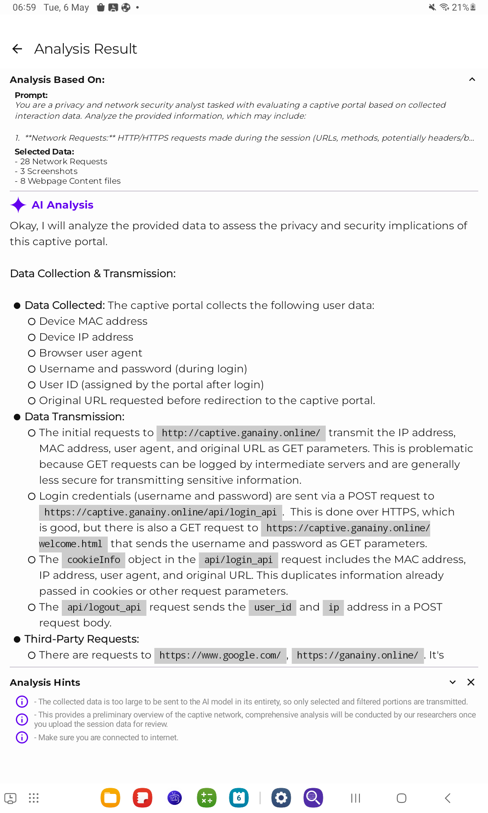
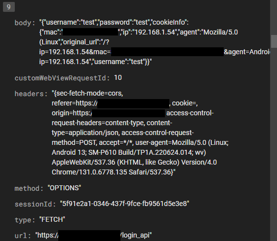
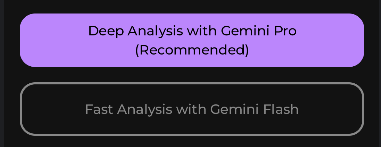
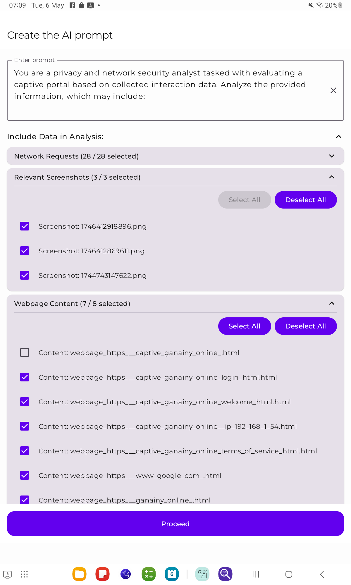

# Captive Portal Analyzer

## Overview

This app focuses on analyzing captive portals. It provides an interface for interacting with captive portals directly through the app by gathering POST request bodies, headers, creating sessions, capturing screenshots, and analyzing their data collection and privacy using AI-powered analysis. Additionally, the app allows uploading analyzed data for further examination by our team.
> **Note:** The app is designed to work with physical devices only since it interacts with real captive portals. 

---
## Project Structure
For detailed information about the project files structure and architecture, see [Project Structure](APP_STRUCTURE.md).

## Features

- Interact with captive portals seamlessly.
- Automatically gather and manage POST request bodies and headers.
- Filter and view collected requests details.
- Automatically create and manage sessions effortlessly.
- Automatically capture screenshots of portal interactions.
- Perform AI-powered privacy and data collection analysis.
- Upload analyzed data for extended review by our team.
> All login/sign up data is stored locally and not sent to the backend unless users choose to upload,
> nonetheless it is preferable to use fake data when signing up/logging in.
---

## Tech Stack

- **Language:** Kotlin
- **Framework:** Jetpack Compose
- **Architecture:** MVVM (Model-View-ViewModel)
- **Libraries:**
    - Room for local database
    - Coil for image & video loading
    - [Gemini AI SDK](https://github.com/google-gemini/generative-ai-android) for AI integration
    - [Compose Markdown](https://github.com/jeziellago/compose-markdown) for rendering markdown content
    - [Android Request Inspector WebView](https://github.com/acsbendi/Android-Request-Inspector-WebView) for network analysis
    - Integration with [PCAPDroid](https://github.com/emanuele-f/PCAPdroid) for packet capture
    - OkHttp for network requests
- **Backend:**
    - Firebase Firestore for data storage
    - Firebase Storage for image storage

---

## Preview

### Video Demonstrations:

#### Collecting information about a captive portal network:
[](https://youtu.be/PmHeJZrM6Co)
<br>

#### Upload collected data to remote Server & Analyze it with AI:
[](https://youtu.be/NX1KBVDysGk)
<br>

### Screenshots:
| Feature                                                                                    | Screenshot                                                      |
|--------------------------------------------------------------------------------------------|-----------------------------------------------------------------|
| **Interacting with captive portal from the app**                                           |                              |
| **Detailed View of collected data**                                                        |                              |
| **Filter collected requests**                                                              |                              |
| **Show each collected request in details**                                                 |                              |
| **AI Insights about the captive portal**                                                   |                              |
| **Control language & theme**                                                               |                              |
| **Fetched request bodies saved to backend**                                                |                              |
| **Screenshots collected are uploaded to firebase storage under their session**             |                    |
| **HTML & JavaScript files collected are uploaded to firebase storage under their session** |  |
| **Packet capture file is uploaded to firebase storage under their session**                |                      |
---

### Integration with [PCAPDroid](https://github.com/emanuele-f/PCAPdroid) (See branch `android-pcap-api`)
| Feature                                                                                                                 | Screenshot                                     |
|-------------------------------------------------------------------------------------------------------------------------|------------------------------------------------|
| **Instructions screen to help user do the one time setup of PCAPDroid**                                                 |  |
| **User can choose to use the JS injection WebView only or JS injection WebView + PCAPDroid packet capture**             |           |
| **User is instructed to stop the capture & Select the captured .pcap file**                                             |           |
| **The resulting .pcap file from PCAPDroid is uploaded to the remote server with the previously collected network data** |           |
---
> **Note:** The starting and ending of packet capture is directly handled within the app.

Here's a clearer and well-formatted version of your Markdown:

### 🆕 New Features: More AI Models & Fine-Grained File Control

You now have access to more Gemini AI models and detailed control over which files are included in the analysis. The `.pcap` file can also be converted to JSON and added to the AI prompt for better results.

| Feature                                                                                                                                                                | Screenshot |
|------------------------------------------------------------------------------------------------------------------------------------------------------------------------|------------|
| **Choose between different Gemini models**                                                                                                                             |  |
| **Manually select which Requests / Screenshots / HTML / JavaScript files to include in analysis**                                                                      |  |
| **Convert `.pcap` files to JSON using a remote server** [More info on backend setup here](https://github.com/ganainy/aws-server-for-pcap-to-json-conversion/tree/main) |  |
| **Include the converted `.pcap` JSON in the AI prompt for improved accuracy**                                                                                          |  |
| **Preview the full prompt before sending it to the AI model**                                                                                                          |  |

## How to Run the App

1. Clone the repository:
   ```bash
   git clone https://github.com/ganainy/captive-portal-analyzer-kotlin.git
   ```

2. Set up API Keys and Configuration:

   a. **Gemini AI API Key:**
    - Get your API key from [Google AI Studio](https://makersuite.google.com/app/apikey)
    - Create secrets.properties in the root directory of the project
   (the same level where local.properties and local.defaults.properties are located)
    - Add your Gemini AI API key to `secrets.properties` as follows:
      ```properties
      API_KEY_RELEASE="your_api_key_here"
      ```

   b. **Firebase Setup:**
    - Go to [Firebase Console](https://console.firebase.google.com/)
    - Create a new project or select an existing one
    - Download the `google-services.json` file
    - Place `google-services.json` in the `app` directory

   c. **Server Setup for PCAP to JSON conversion:**
    - In `AutomaticAnalysisViewModel.kt`, update the `SERVER_UPLOAD_URL` and `SERVER_STATUS_URL_BASE` constants.
    - Ensure the server can accept the `.pcap` file and convert it to JSON format. For guidance, refer to:
      [AWS Server for PCAP to JSON Conversion](https://github.com/ganainy/aws-server-for-pcap-to-json-conversion)

3. Build and run the project on a physical device.


---

## Contributions

Contributions are welcome! Feel free to submit a pull request or report issues to enhance the app.

---
